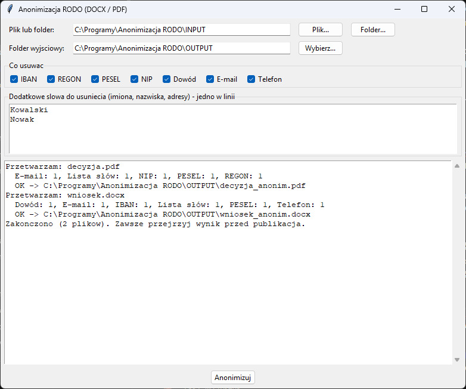
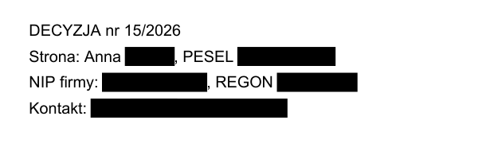

# Anonimizacja RODO (DOCX / PDF)

Program **lokalny** — działa w całości na Twoim komputerze, nigdzie nie wysyła
dokumentów. Z internetem łączy się tylko po to, żeby sprawdzić
[aktualizacje](#aktualizacje). Do przygotowania pism do
publikacji w BIP, odpowiedzi na wnioski o informację publiczną, przekazania
dokumentów dalej bez danych osobowych.



## Co usuwa

| Kategoria | Przykład | Jak rozpoznaje |
|-----------|----------|----------------|
| PESEL | `44051401359` | 11 cyfr + **suma kontrolna** |
| NIP | `123-456-32-18`, `PL1234563218` | 10 cyfr (z myślnikami lub bez) + suma kontrolna |
| REGON | `123456785`, `12345678512347` | 9 lub 14 cyfr + suma kontrolna |
| Dowód | `ABA 300000` | 3 litery + 6 cyfr + suma kontrolna |
| IBAN | `PL61 1090 1014 0000 0712 1981 2874` | 26 cyfr (z `PL` lub bez) + suma kontrolna |
| E-mail | `jan@urzad.gov.pl` | wzorzec adresu |
| Telefon | `+48 600 700 800`, `600-700-800`, `(22) 123 45 67` | numer z separatorami albo z `+48` |
| Lista słów | imiona, nazwiska, adresy, nazwy firm | wpisane ręcznie w okienku, wielkość liter bez znaczenia |

Sumy kontrolne sprawiają, że przypadkowe liczby (kwoty, numery spraw) nie
są usuwane. Program usuwa tylko numery, które naprawdę mogą być PESEL-em,
NIP-em itd.

**Imion, nazwisk i adresów program nie rozpozna sam.** Wpisz je
w okienku „Dodatkowe słowa” (jedno w linii).

## Jak usuwa

- **PDF** — tekst jest **wycinany z pliku**, a w jego miejscu zostaje czarny
  prostokąt. To nie jest zakrycie: danych nie da się odzyskać przez
  zaznaczenie, skopiowanie ani usunięcie prostokąta. Obrazy pod
  prostokątem też są zamazywane. **Pola formularza** (wypełnione wnioski PDF)
  też są sprawdzane, a znalezione w nich dane zamieniane na `*`.
- **DOCX** — znaki zamieniane są na `*`, długość tekstu się nie zmienia,
  więc układ dokumentu zostaje. Przetwarzane są treść, tabele, nagłówki,
  stopki, przypisy, tekst usunięty w trybie śledzenia zmian oraz adresy
  hiperłączy (np. `mailto:`).
- **Metadane** (autor, ostatnio modyfikował, tytuł, komentarz) są czyszczone
  w obu formatach. W DOCX usuwane są też właściwości „Firma”, „Menedżer”
  i właściwości niestandardowe.

Wynik trafia do folderu wyjściowego jako `nazwa_anonim.pdf` /
`nazwa_anonim.docx`. Oryginał nie jest zmieniany.

## Instalacja (jednorazowo)

1. **Python** — pobierz z [python.org](https://www.python.org/downloads/windows/)
   (wersja 3.9 lub nowsza). W instalatorze zaznacz **„Add python.exe to PATH”**.
   Opcja „tcl/tk and IDLE” jest zaznaczona domyślnie i musi taka zostać.
   Uprawnienia administratora nie są potrzebne.
2. **Program** — na stronie [github.com/DawidBochno/Anonimizacja-RODO](https://github.com/DawidBochno/Anonimizacja-RODO)
   kliknij zielony przycisk **Code → Download ZIP**. Rozpakuj archiwum,
   np. do `C:\Programy\Anonimizacja RODO`. Nie uruchamiaj programu z wnętrza ZIP-a.
3. Kliknij dwukrotnie **`install.bat`**. Instaluje biblioteki `PyMuPDF` i `python-docx` (potrzebny internet) i uruchamia test. Na końcu pojawia się
   **„selftest OK”**, co znaczy, że wszystko działa.
   Jeśli Windows pokaże „System Windows ochronił ten komputer”, kliknij
   **Więcej informacji → Uruchom mimo to**.
4. Program uruchamia się plikiem **`uruchom.bat`**. Wygodnie jest zrobić
   skrót na pulpicie: prawy przycisk na `uruchom.bat` → **Wyślij do →
   Pulpit (utwórz skrót)**.

## Jak używać

1. Uruchom `uruchom.bat`.
2. **Plik lub folder** — przycisk **Plik…** wskazuje jeden dokument,
   **Folder…** cały folder z plikami DOCX i PDF. Domyślnie jest to `INPUT`.
3. **Folder wyjściowy** — tu trafią wyniki (domyślnie `OUTPUT`).
4. **Co usuwać** — odznacz kategorie, które mają zostać, np. NIP firmy
   w umowie publikowanej w BIP.
5. **Dodatkowe słowa** — imiona, nazwiska, adresy, nazwy ulic, po jednym
   w linii. Wielkość liter nie ma znaczenia.
6. Kliknij **Anonimizuj**. Log pokazuje, co i ile usunięto w każdym pliku.
7. Wyniki mają w nazwie `_anonim` i leżą w folderze wyjściowym. Oryginały
   zostają bez zmian. **Zawsze przejrzyj wynik przed publikacją.**

Wynik w PDF. Tekst jest wycięty trwale, a nie tylko zakryty, więc nie
da się go skopiować ani odczytać spod czarnego prostokąta:



## Aktualizacje

Po uruchomieniu program sprawdza w tle na GitHubie, czy jest nowa wersja.
Jeśli jest, pyta **„Pobrać i zainstalować teraz?”**. Pobierane są tylko
zmienione pliki programu. Foldery `INPUT`, `OUTPUT`, ustawienia i pliki
w `przyklad/` nie są nadpisywane. Po aktualizacji zamknij i uruchom program ponownie. Jeśli program
o to poprosi, uruchom też raz `install.bat` (zmieniły się biblioteki).

- Do GitHuba trafia tylko zapytanie o listę plików programu, **nigdy
  dokumenty ani dane**.
- Bez internetu albo przy blokadzie (np. UTM) program działa normalnie,
  bez żadnego komunikatu.
- **Wyłączenie** (np. gdy programy aktualizuje dział IT): utwórz w folderze
  programu pusty plik o nazwie `NIE_AKTUALIZUJ`.
- Kopię pobraną przez `git clone` aktualizuje się poleceniem `git pull`.

## Ograniczenia

- **Skany PDF bez warstwy tekstowej** nie są obsługiwane, program zgłosi
  błąd. Najpierw przepuść je przez OCR (np. program *PDF-PNG-JPG na DOCX*).
- PDF zabezpieczony hasłem trzeba najpierw odbezpieczyć.
- Gdy w logu pojawi się komunikat **„nie udało się zlokalizować na
  stronie”**, dane zostały znalezione w tekście, ale nie dało się ich
  wskazać na stronie (np. nietypowe kodowanie czcionki). Sprawdź taki plik
  ręcznie.
- DOCX: komentarze recenzenckie i tekst w grafikach SmartArt
  nie są przetwarzane. Usuń komentarze przed anonimizacją.
- Formaty `.doc`, `.odt` i `.xlsx` nie są obsługiwane. Zapisz plik jako DOCX
  albo PDF.

## Testy

```bash
python anonimizacja.py --selftest
```

Test sprawdza sumy kontrolne, wykrywanie wszystkich kategorii, PESEL
rozcięty na dwa fragmenty formatowania w DOCX, stopkę, metadane oraz to,
czy tekst rzeczywiście znika z PDF (a nie jest tylko zakryty).
